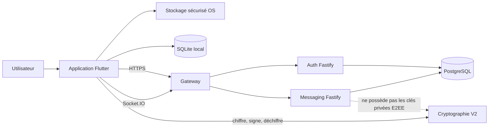
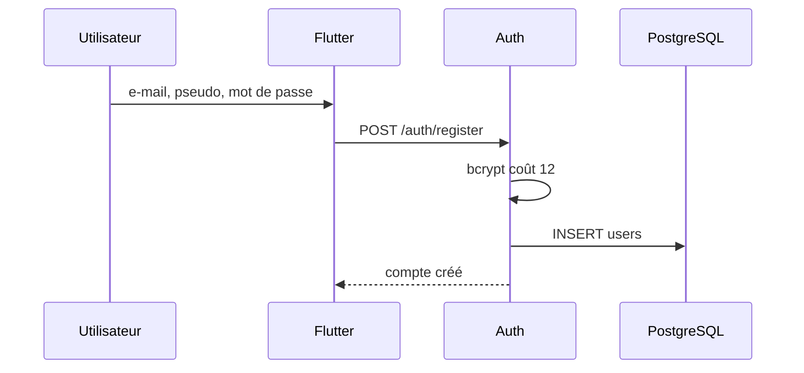
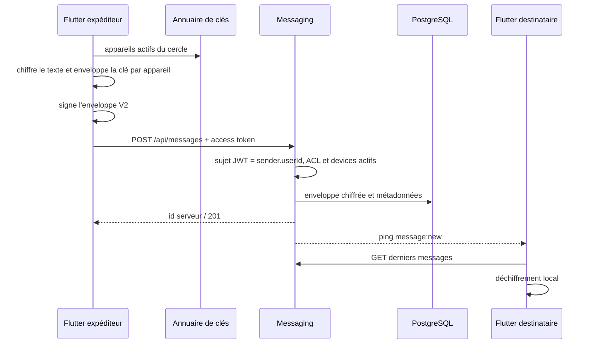

# Référence fonctionnelle de l'application

Statut : comportement observé, non contractuel pour une release
Dernière mise à jour : 2026-08-25
Code observé : branche `main`, changement `TC-106` lot A
Tâche : `TC-009`

## Objet et règles de lecture

Ce document explique le fonctionnement de CircleHaven — Trust Circle tel qu'il existe dans le dépôt. Il sert de carte d'ensemble pour le développement, les tests, les revues de sécurité et les futurs assistants.

Trois qualifications sont utilisées :

- **Observé** : le comportement est présent dans le code inspecté ; cela ne signifie pas qu'il est correctement testé ou publiable.
- **Cible V1** : le comportement a été décidé dans les documents produit mais n'est pas nécessairement implémenté.
- **Écart** : le comportement observé est incomplet, dangereux ou contradictoire avec la cible.

La spécification détaillée du chiffrement est dans [`CRYPTOGRAPHY_V2.md`](../security/CRYPTOGRAPHY_V2.md). Les garanties obligatoires sont dans [`SECURITY_INVARIANTS.md`](../security/SECURITY_INVARIANTS.md).

## Vue d'ensemble

Le client Flutter détient les clés privées E2EE et traite le texte en clair. Auth gère les comptes et sessions. Messaging gère les cercles, conversations, clés publiques, enveloppes chiffrées et événements temps réel. PostgreSQL est partagé par les deux services dans le prototype.

Le staging actuellement validé est isolé sur le loopback du LXC106. Le client Flutter utilise encore des URL historiques codées en dur et ne pointe pas automatiquement vers ce staging.

## Composants et responsabilités

| Composant | Responsabilité observée | Ne doit pas être supposé |
|---|---|---|
| Flutter UI | écrans de compte, cercles, conversations, appareils et messages | interface finalisée, accessible ou adaptée desktop |
| `AuthProvider` | login, stockage des jetons, refresh biométrique, headers HTTP | vérification e-mail, récupération ou révocation multi-session |
| `GroupProvider` | état des cercles, adhésions, membres et appareils | matrice propriétaire/admin/membre complète |
| `ConversationProvider` | conversations, messages, caches, synchronisation et notifications | outbox fiable ou synchronisation durable |
| `WebSocketService` | connexion Socket.IO, reconnexion, abonnements et callbacks | source durable des messages ; les événements sont principalement des pings |
| Auth Fastify | inscription, login, access/refresh JWT, `/me`, logout | gestion complète du cycle de compte |
| Messaging Fastify | REST métier, Socket.IO, présence, matrice ACL et transactions critiques partagées | outbox/idempotence durable ou atomicité des futures mutations non encore écrites |
| PostgreSQL | comptes, sessions, appartenances, clés publiques et enveloppes | outil/registre automatisé de migrations ou séparation des privilèges par service |
| SQLite local | enveloppes, état de synchronisation et caches | base réellement chiffrée ; le fichier est actuellement ouvert avec `sqflite` standard |

## Démarrage du client

État observé :

1. Flutter charge `.env`, impose l'orientation portrait et initialise les notifications locales, la locale française et les services cryptographiques.
2. `AuthProvider.tryAutoLogin()` lit uniquement l'access token du stockage sécurisé. S'il est absent ou expiré, l'utilisateur reste sur l'écran de connexion.
3. Les providers Auth, Group et Conversation sont créés.
4. Après authentification, l'application initialise la surveillance réseau, une base de queue locale, la présence, Socket.IO et les nettoyages de caches.
5. Au retour au premier plan, Socket.IO est reconnecté si nécessaire. En arrière-plan, le heartbeat est ralenti.

Écarts :

- L'orientation portrait est incompatible avec l'expérience Windows/macOS cible.
- La queue locale est initialisée mais n'est pas intégrée au chemin d'envoi V2.
- Les URL et le faux `APP_SECRET` public restent codés/configurés dans le client (`TC-109`).
- L'auto-login ne tente pas directement un refresh expiré ; l'écran de connexion peut ensuite proposer la biométrie.

## Comptes et sessions

### Inscription

Observé : l'e-mail est unique, le mot de passe doit compter au moins huit caractères côté serveur et son hash bcrypt est stocké. L'inscription ne connecte pas automatiquement l'utilisateur.

Non implémenté : vérification d'e-mail, anti-abus d'inscription, récupération de mot de passe et suppression de compte (`TC-401`, `TC-402`, `TC-405`).

### Connexion et jetons

1. Flutter envoie e-mail et mot de passe à `POST /auth/login`.
2. Auth compare le hash bcrypt.
3. Auth émet un access token Ed25519 de 15 minutes et un refresh token HS256 de 30 jours.
4. Une empreinte SHA-256 du refresh token est stockée dans `refresh_tokens`.
5. Flutter conserve access et refresh tokens dans `flutter_secure_storage`; l'access token reste aussi en mémoire.
6. Les requêtes REST protégées envoient l'access token. Socket.IO le transmet dans `handshake.auth.token`.

Le contrat exact est dans [`TOKEN_CONTRACT.md`](../security/TOKEN_CONTRACT.md). Auth est le seul service capable de signer un access token ; Messaging ne reçoit que la clé publique Ed25519.

### Refresh, biométrie et déconnexion

- Quand l'access token expire, `getAuthHeaders()` peut demander une authentification biométrique avant d'envoyer le refresh token.
- `POST /auth/refresh` vérifie le token et son empreinte, puis émet un nouvel access token. Le refresh token n'est pas encore rotatif à usage unique (`TC-403`).
- La déconnexion Flutter supprime localement les deux jetons mais n'appelle pas actuellement `/auth/logout`; le refresh token serveur peut donc rester utilisable jusqu'à expiration.
- La biométrie protège le déclenchement local du refresh, pas le contenu cryptographique lui-même.

## Cercles

### Création

Observé :

1. L'utilisateur saisit un nom.
2. Flutter génère d'abord une paire Ed25519/X25519 sous un espace de noms basé sur le nom du cercle et transmet les clés publiques lors de la création.
3. Messaging crée `groups`, ajoute le créateur dans `user_groups` et peut enregistrer la clé publique Ed25519 dans `group_keys`, le tout dans une transaction unique.
4. Après réception du véritable UUID du cercle, Flutter génère une autre paire sous l'espace `groupId/deviceId` et la publie dans `group_device_keys`.

Les clés générées sous le nom du cercle et la table `group_keys` ne participent pas au chiffrement des messages V2 observé. Le champ X25519 de groupe transmis à la création n'est pas persisté par cette route. Cette duplication est une dette de conception, pas une seconde couche de chiffrement.

### Demande d'adhésion

1. L'utilisateur fournit ou scanne l'UUID du cercle.
2. Flutter obtient son `deviceId`, génère une paire Ed25519/X25519 pour ce cercle et transmet les clés publiques dans une join request.
3. Messaging crée `join_requests` avec le sujet JWT, l'appareil et les clés publiques. Un verrou de cercle et un index unique partiel garantissent au plus une demande `pending` par utilisateur et cercle, y compris en concurrence.
4. Seuls le propriétaire et les administrateurs peuvent voir puis accepter ou refuser la demande.
5. La route de vote historique est neutralisée et le client ne l'utilise plus.
6. À l'acceptation, l'utilisateur rejoint `user_groups`, la clé initiale est copiée dans `group_device_keys` avec le statut `active` et la demande change de statut dans la même transaction. Une décision concurrente perdante est refusée.
7. Des pings `group:member_joined` et `group:joined` demandent aux clients de rafraîchir leurs données, uniquement après commit.

Depuis `TC-104`, `groups.creator_id` détermine l'unique propriétaire et `user_groups.role` distingue administrateur et membre. Seul le propriétaire peut affecter ces deux rôles ; le transfert de propriété reste hors de ce parcours.

### Consultation

- `GET /api/groups` retourne uniquement les cercles du sujet JWT.
- Les détails et membres vérifient l'appartenance via la matrice ACL et exposent le rôle effectif du sujet.
- Les événements de cercle ne transportent volontairement qu'un identifiant minimal dans les nouvelles émissions.

## Appareils et clés publiques

### Identifiant d'appareil

`SessionDeviceService` valide l'UUID du sujet, crée un UUID propre à ce compte et le stocke sous `device_id_v2:account:<userId>`. L'ancien `device_id_v1` global n'est pas réutilisé implicitement. Le cache mémoire des identifiants est purgé à la déconnexion ou au changement de compte.

### Registre de confiance du compte

Le lot B de `TC-106` ajoute dans Messaging un registre distinct des clés de cercle :

1. pour un premier appareil, Auth revérifie le mot de passe et remet un grant opaque de 5 minutes dont seule l'empreinte est stockée ;
2. le client demande un challenge authentifié avec son UUID, sa clé publique Ed25519 d'identité, sa plateforme, son nom et ce grant initial ;
3. le serveur renvoie un nonce CSPRNG et les 163 octets exacts à signer ;
4. le client signe localement puis transmet uniquement la signature ;
5. Messaging consomme le challenge à la première tentative et vérifie Ed25519 ;
6. le premier appareil réautorisé et prouvé devient `active`, les suivants restent `pending`.

Les transitions sont sérialisées en verrouillant la ligne du compte. Un autre sujet JWT ne peut pas consulter ou consommer le challenge. `GET /api/devices` ne retourne que le registre du sujet. La spécification complète et le vecteur sont dans [`DEVICE_TRUST_PROTOCOL_V1.md`](../security/DEVICE_TRUST_PROTOCOL_V1.md).

### Paire par cercle

Pour chaque couple `groupId/deviceId`, `KeyManagerFinal` génère :

- une paire Ed25519 pour les signatures ;
- une paire X25519 statique de destinataire pour recevoir les clés de message.

Les seeds privés et clés publiques sont stockés via `flutter_secure_storage`. Leur création est explicite ; toute paire partielle, invalide ou incohérente est refusée sans suppression ni régénération. Le détail des noms, tailles et usages est dans [`CRYPTOGRAPHY_V2.md`](../security/CRYPTOGRAPHY_V2.md).

### Annuaire et cache

- Le client publie ses clés dans `POST /api/keys/group/:groupId/devices`; l'identité utilisateur vient du JWT.
- `GET /api/keys/group/:groupId` renvoie les appareils actifs et leurs clés publiques.
- La lecture de l'annuaire, la publication, la liste personnelle et la révocation exigent toutes l'appartenance au cercle ; un sujet ne gère que ses propres appareils.
- Un cache mémoire puis SQLite de 30 jours évite certains appels réseau.
- Les empreintes SHA-256 stockées détectent une corruption locale d'une entrée en cache, mais il n'existe pas de journal de transparence ni de comparaison fiable contre un historique approuvé.

### Révocation

- Un utilisateur peut mettre l'un de ses appareils à l'état `revoked` pour un cercle.
- Messaging refuse qu'un appareil révoqué republie simplement les mêmes clés et vérifie le statut actif lors d'un envoi. Publication et révocation partagent des contrôles verrouillés ; l'upsert conditionnel ne peut jamais réactiver une ligne `revoked`, même en concurrence.
- Les caches locaux tentent d'invalider les entrées associées.

Écarts : le cloisonnement local, le registre de compte et la preuve de possession backend sont réalisés, mais le client n'exécute pas encore ce parcours. Il n'existe encore ni approbation par un appareil actif, ni liaison obligatoire aux clés de cercle, ni notification de changement de clé (`TC-106`, lots C et D). Une révocation n'efface pas les messages ou clés déjà obtenus par l'appareil.

## Conversations

### Création

Flutter transmet `groupId`, `type` et une liste de membres ciblés. Messaging :

1. vérifie par la matrice ACL que le sujet et chaque UUID ciblé appartiennent au même cercle ;
2. refuse avant toute insertion si un seul participant est extérieur ;
3. crée la conversation et ajoute les participants validés ;
4. rejoint leurs sockets aux rooms utiles puis émet un ping `conversation:created`.

Depuis `TC-105`, les contrôles d'appartenance verrouillés, la conversation et tous ses participants sont écrits sur la même connexion et dans la même transaction. Les rooms et le ping `conversation:created` ne sont modifiés ou émis qu'après commit ; une panne intermédiaire ne laisse aucune conversation partielle.

### Lecture et accusés

- La liste des conversations est filtrée par `conversation_users` et le sujet JWT.
- Le détail, les membres, les messages et lecteurs exigent à la fois l'appartenance à la conversation et au cercle parent via le service ACL.
- `POST /api/conversations/:id/read` verrouille l'accès et met `last_read_at` à l'heure serveur dans une transaction, puis émet `conv:read` après commit.
- Les indicateurs de frappe sont émis uniquement après vérification d'appartenance par Messaging.

## Envoi d'un message V2

Le backend ne reçoit pas le texte en clair ni les seeds privés. Il reçoit cependant tous les identifiants de contexte et d'appareil. La construction cryptographique exacte est documentée séparément.

Le serveur refuse :

- un `sender.userId` différent du sujet JWT ;
- un expéditeur absent de la conversation ;
- un appareil expéditeur inactif ;
- un destinataire absent de la conversation ou dont l'appareil est inactif ;
- un `messageId` déjà persisté.

Depuis `TC-105`, ces contrôles verrouillent dans une même transaction l'appartenance, la conversation et les clés actives jusqu'à l'insertion. Tous les couples destinataire/appareil sont validés par une requête PostgreSQL groupée plutôt que par une requête par appareil, puis `message:new` est émis après commit. Les validations de taille et d'encodage restent incomplètes (`TC-107`).

## Réception, affichage et notifications

### Chargement initial

1. Le client tente de charger jusqu'à 20 enveloppes de la conversation depuis SQLite.
2. Il interroge le serveur en arrière-plan et fusionne les messages par `messageId`/timestamp.
3. Les messages visibles peuvent être déchiffrés à la demande par le chemin complet.
4. Une enveloppe non authentifiée n'alimente jamais le cache de texte ; SQLite conserve principalement l'enveloppe V2 et le statut de signature.

### Nouveau message temps réel

Messaging émet actuellement un ping minimal `message:new` contenant `convId` et `groupId`, pas le contenu. Si la conversation est ouverte, Flutter relit les derniers messages via REST et filtre ceux déjà connus.

Depuis `TC-114`, les chemins REST, Socket.IO, écran et caches passent par `decryptVerified`. Version, contexte, destinataire et appareil expéditeur sont contrôlés, puis Ed25519 est vérifié dans l'isolate avant toute ouverture exploitable. Le texte et la clé de message n'atteignent cache, UI et notification qu'après succès du tag AES-GCM.

La latence est limitée sans affaiblissement : priorité aux messages visibles dans la file crypto, clés publiques déjà validées en cache et aucun aller-retour réseau supplémentaire lorsque l'annuaire local est disponible. Les mesures finales sur Android et Windows restent attachées à `TC-114`.

### Notifications

- Les notifications in-app et locales sont calculées sur le client.
- Le code peut inclure le texte déchiffré et un nom d'expéditeur dans une notification locale.
- Aucun fournisseur de push distant n'est intégré dans l'état observé.
- Depuis `TC-114`, les chemins de notification ne journalisent plus d'extrait du texte déchiffré.

## Stockage local et comportement hors ligne

| Stockage | Contenu observé | Protection réelle | Limite |
|---|---|---|---|
| `flutter_secure_storage` | jetons, `deviceId` par compte, seeds Ed25519/X25519, clés maîtres locales | mécanisme OS selon plateforme ; sélection des clés via un `deviceId` propre au compte | registre de confiance serveur encore absent |
| `messages_encrypted.db` | enveloppes V2, métadonnées, statut de signature, état de sync, caches | SQLite `sqflite` standard | la clé DB générée n'est pas utilisée |
| `message_keys_cache` | clés de message chiffrées | AES-GCM, clé maître CSPRNG propre au compte, index compte/appareil/message | SQLite non chiffré et TTL 7 jours |
| `group_keys_cache` | clés publiques et empreintes | intégrité logique locale | pas d'ancrage de confiance serveur |
| mémoire | textes déchiffrés, clés, états providers | caches cryptographiques purgés au changement de sujet et à la déconnexion | isolation du processus seulement |
| `message_queue.db` | structure de messages en attente | SQLite standard | chemin V2 non raccordé, sérialisation non JSON |

L'application n'est donc pas encore offline-first de façon fiable. La reprise se fonde sur timestamps et relecture des derniers messages, sans curseur durable/idempotence client complètement intégrés (`TC-501` à `TC-508`).

## Temps réel et présence

### Authentification Socket.IO

Le handshake exige l'access token strict et, transitoirement, le faux `APP_SECRET` public. Messaging dérive `userId` du token, rejoint `user:<id>` et les rooms des cercles présents en base.

### Événements entrants du client

| Événement | Donnée utile | Contrôle serveur |
|---|---|---|
| `conv:subscribe` | `convId` | ACL conversation + cercle parent |
| `conv:subscribe:batch` | `convIds[]` | ACL partagée filtrant les conversations autorisées |
| `conv:unsubscribe` | `convId` | sortie systématique de la room ; ACL avant toute émission de présence |
| `typing:start` / `typing:stop` | `convId` | ACL conversation + cercle parent |

Aucun `userId` fourni par ces événements ne fait autorité ; l'acteur est celui du socket authentifié.

### Événements émis

| Événement | Fonction |
|---|---|
| `message:new` | ping minimal demandant une relecture REST |
| `conversation:created` | signale une nouvelle conversation dans un cercle |
| `group:joined`, `group:member_joined` | signale un changement d'adhésion |
| `presence:update`, `presence:conversation`, `presence:conversation:batch` | présence en mémoire par socket |
| `typing:start`, `typing:stop` | frappe éphémère |
| `conv:read` | accusé de lecture avec heure serveur |

La présence n'est pas durable et n'utilise pas Redis. Un redémarrage de Messaging remet l'état à zéro. Plusieurs handlers Flutter tolèrent mal les nouveaux pings minimaux et conservent des attentes de champs historiques ; cette compatibilité doit être nettoyée.

## Données visibles selon la frontière

| Acteur/composant | Peut voir |
|---|---|
| Auth | e-mail, pseudo, hash du mot de passe, identifiant, empreinte refresh, métadonnées HTTP/logs |
| Messaging | comptes référencés, cercles, membres, conversations, appareils, clés publiques, expéditeur/destinataires, horaires, tailles et enveloppes chiffrées |
| PostgreSQL/opérateur | toutes les données serveur précédentes, ciphertext, wraps, signature, clé éphémère publique, sel et nonces |
| Reverse proxy/hébergeur | adresses réseau, horaires, routes, tailles et métadonnées TLS selon configuration |
| Appareil expéditeur | texte, clés privées locales, liste des appareils destinataires et enveloppe complète |
| Appareil destinataire | messages possédant un wrap pour cet appareil, annuaire public du cercle et copies locales |

L'E2EE vise le contenu, pas l'anonymat ni la dissimulation du graphe social au serveur.

## Inventaire des routes observées

Toutes les routes métier exigent actuellement `X-Client-Version`, le faux `X-App-Secret` et, sauf inscription/login/refresh/logout selon leur contrat, un access token.

| Service | Route | Fonction |
|---|---|---|
| Auth/Messaging | `GET /health` | état minimal du processus |
| Auth | `POST /auth/register` | créer un compte |
| Auth | `POST /auth/login` | créer access/refresh et enregistrer la session |
| Auth | `POST /auth/refresh` | échanger un refresh valide contre un access |
| Auth | `GET /auth/me` | lire le compte du sujet access |
| Auth | `POST /auth/logout` | révoquer l'empreinte refresh fournie |
| Messaging | `POST/GET /api/groups` | créer/lister les cercles |
| Messaging | `GET /api/groups/:id` | détail d'un cercle |
| Messaging | `GET /api/groups/:id/members` | membres d'un cercle |
| Messaging | `POST /api/groups/:id/join` | ancienne variante de join request |
| Messaging | `POST /api/groups/:id/join-requests` | join request actuelle |
| Messaging | `GET /api/groups/:id/join-requests` | demandes en attente |
| Messaging | `POST .../vote` | route héritée toujours refusée |
| Messaging | `POST .../handle` | accepter/refuser, propriétaire ou administrateur |
| Messaging | `PATCH .../members/:memberId/role` | affecter admin/membre, propriétaire seulement |
| Messaging | `POST .../requests/:rid/accept|reject` | variantes historiques |
| Messaging | `GET /api/keys/group/:groupId` | annuaire actif du cercle |
| Messaging | `GET .../my-devices` | appareils du sujet, actifs ou révoqués |
| Messaging | `POST .../devices` | publier/remplacer les clés du sujet |
| Messaging | `DELETE .../devices/:deviceId` | révoquer un appareil du sujet |
| Messaging | `POST/GET /api/conversations` | créer/lister les conversations |
| Messaging | `GET /api/conversations/:id` | détail et membres |
| Messaging | `POST .../:id/read`, `GET .../:id/readers` | accusés de lecture |
| Messaging | `POST /api/messages` | persister une enveloppe V2 |
| Messaging | `GET /api/conversations/:id/messages` | page de messages V2 |

Le fichier OpenAPI actuel ne couvre pas encore fidèlement toutes ces routes et divergences (`TC-107` et travail API ultérieur).

## État des fonctionnalités visibles

| Fonction | État observé | Cible/publication |
|---|---|---|
| inscription/login | prototype fonctionnel | compléter vérification, récupération et erreurs |
| biométrie | protège le refresh local | UX et plateformes à valider |
| cercles | création, liste, demande, décision owner/admin, rôles | transfert de propriété et UX de gestion à finaliser |
| QR d'adhésion | lecture d'un identifiant de cercle | format d'invitation sûr à concevoir |
| conversations | création/liste/détail atomiques avec ACL commune | idempotence et synchronisation durable à traiter en Phase 5 |
| texte E2EE V2 | envoi/réception avec vérification avant usage | protocole V3 et validation appareils réels requis |
| appareils | liste/publication/révocation partielle | preuve et approbation requises |
| présence/frappe/lecture | temps réel en mémoire | confidentialité, limites et fiabilité à tester |
| stockage hors ligne | cache partiel | chiffrement au repos et sync fiable requis |
| notifications locales | prototype | ne jamais utiliser de contenu non vérifié |
| calendrier | écran factice | hors V1 |
| carte/localisation | écran factice | hors V1 |
| pièces jointes/appels | absent | hors V1 |
| client Web | absent | site public seulement en V1 |
| suppression/export | absent | requis avant publication |

## Ordre conseillé pour modifier un flux

Avant toute évolution :

1. identifier le parcours dans ce document ;
2. suivre les fichiers dans [`TRACEABILITY.md`](TRACEABILITY.md) ;
3. vérifier les invariants concernés ;
4. ouvrir ou raffiner une fiche `TC-xxx` ;
5. mettre à jour simultanément comportement, tests, OpenAPI et documentation ;
6. ne jamais remplacer la description d'un écart par une promesse tant que la preuve n'existe pas.
