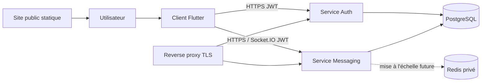

# Architecture système

Statut : état observé et cible V1 provisoire
Dernière mise à jour : 2026-08-25

## Vue logique

Le schéma est logique. L'inventaire réel du LXC et du staging est conservé dans `docs/operations/`; le client utilise encore des URL historiques codées en dur et n'est pas connecté au staging local par défaut.

## Composants actuels

| Composant | Responsabilité | État |
|---|---|---|
| Client Flutter | UI, identité d'appareil, chiffrement/déchiffrement, cache et synchronisation | Prototype mobile, desktop incomplet |
| Auth Fastify | comptes, mots de passe, JWT, refresh tokens et réautorisation du premier appareil | Access Ed25519 et refresh HS256 séparés ; grant de bootstrap opaque et court par `TC-106` |
| Messaging Fastify | registre d'appareils, cercles, membres, conversations, clés publiques, messages et temps réel | Preuve et approbation signée présentes ; révocation globale encore incomplète |
| PostgreSQL | identités, appartenances, clés publiques, enveloppes chiffrées, sessions | Initialisé par script ; quatre migrations réversibles versionnées mais encore appliquées manuellement |
| Redis | prévu pour présence/pub-sub | Non utilisé par l'application ; présence en mémoire du processus |
| Nginx/proxy externe | terminaison/routage HTTP(S) | Staging loopback sans exposition publique ; TLS restreint reporté à `TC-113` |
| Site public | acquisition, téléchargements, légal, support | à créer |

## Frontières de confiance

- Le client et toutes ses entrées sont non fiables pour le serveur, même s'il possède un `APP_SECRET` embarqué.
- Les jetons sont non fiables tant que signature, type, émetteur, audience, algorithme et expiration ne sont pas vérifiés.
- Le service de messagerie ne doit jamais accepter `userId`, rôle ou appartenance comme preuve d'identité.
- PostgreSQL et l'opérateur peuvent voir les métadonnées stockées ; le contenu E2EE doit rester opaque.
- Les notifications push transitent par des fournisseurs tiers et ne doivent contenir ni message ni secret.
- L'appareil local est une zone sensible : les clés privées doivent utiliser le stockage sécurisé de l'OS et les caches doivent être chiffrés réellement.

## Flux d'envoi cible

1. Le client prépare un identifiant de message unique et une enveloppe canonique versionnée.
2. Il chiffre pour les appareils autorisés et signe tous les champs liés au contexte.
3. Le message entre dans une outbox durable avec état explicite.
4. Le backend authentifie le jeton d'accès, dérive l'expéditeur et vérifie transactionnellement l'appartenance à la conversation.
5. Une contrainte d'idempotence accepte une seule fois l'identifiant client.
6. Le backend persiste l'enveloppe opaque et produit un curseur de synchronisation durable.
7. Les destinataires vérifient version, contexte, signature et clé avant tout affichage ou notification locale.

## Direction V1

Conserver deux services déployables pour éviter une réécriture prématurée, mais partager un paquet de contrats/type JWT et des règles d'autorisation testées. PostgreSQL reste la source durable. Redis est retiré tant qu'une instance messaging suffit ; il ne revient que pour un besoin de mise à l'échelle démontré avec l'adaptateur Socket.IO approprié.

La configuration publique (URL, environnement, version minimum) doit être distincte des secrets serveur. Un client public ne contient aucun secret d'authentification commun.

## Références d'implémentation

- [`FUNCTIONAL_REFERENCE.md`](FUNCTIONAL_REFERENCE.md) décrit les parcours actuels, routes, événements, stockages et écarts à la cible.
- [`TRACEABILITY.md`](TRACEABILITY.md) relie chaque responsabilité à ses fichiers et tâches.
- [`CRYPTOGRAPHY_V2.md`](../security/CRYPTOGRAPHY_V2.md) spécifie le protocole effectivement observé, y compris ses limites critiques.

## Qualités obligatoires

- Sécurité par défaut et refus en cas de configuration critique absente.
- Autorisations centralisées et testées par table de rôles.
- Opérations idempotentes et traçables sans contenu sensible.
- Migrations compatibles avec un déploiement progressif et rollback.
- Contrat d'API versionné et générateur de schémas partagé lorsque pertinent.
- Comportement offline-first déterministe, sans perte silencieuse.
